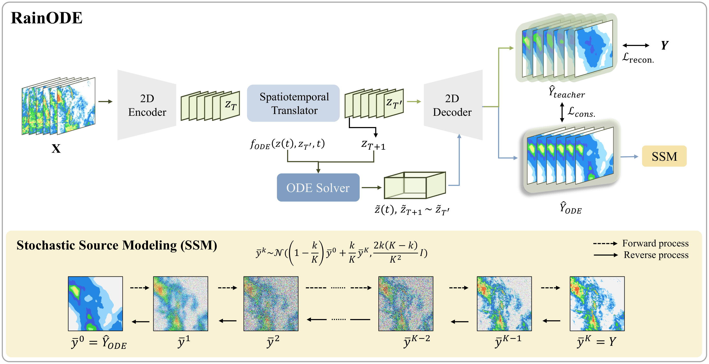

# ☔ RainODE: Continuous-Time Precipitation Forecasting with Latent Neural ODEs

**Accepted to ECCV 2026**

RainODE is a **continuous-time precipitation forecasting framework** based on latent Neural ODEs.  
It models precipitation evolution as a continuous latent trajectory and refines fine-scale intensity variations using a stochastic source modeling module.

<p align="center">
  <br>
  <em>Overview of RainODE for continuous-time precipitation forecasting.</em>
</p>

---

## 📦 Installation

Install the required dependencies using:

```bash
pip install -r requirements.txt
```

---

## 📁 Dataset Preparation

For SEVIR data, we infer the data preparation code from [PreDiff](https://github.com/gaozhihan/PreDiff).  
Place the data as: ```./sevir/data/vil/..```

--- 

## ☁️ Latent ODE

For training, run:
```bash
python3 train_ode.py
```

To generate outputs from Latent ODE predictions, run:
```bash
python3 mk_ode_output.py
```
The generated files will be saved in `/RainODE/ode_output`.

---

## 💧 Stochastic Source Modeling

The SSM is trained in the `source_model` directory. 


```bash
cd ./source_model
```

Our implementation follows the [BBDM](https://github.com/xuekt98/bbdm) framework. 
Before training SSM, download `vq-f4.ckpt` from the repository and place it under the `source_model/` directory.

For training, run:

```bash
python3 main.py \
  --config configs/Template-LBBDM-f4.yaml \
  --train \
  --sample_at_start \
  --save_top \
  --gpu_ids 0
```

To save prediction outputs:

```bash
python3 mk_bbdm_output.py 
```
The generated files will be saved in `/RainODE/bbdm_output`.

---
## 📈 Evaluation
To evaluate metrics with produced PNG files:
```bash
python3 eval_png.py
```

